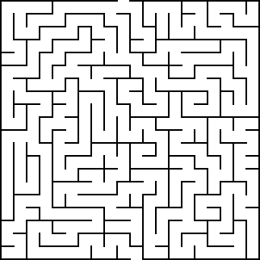

# Lesson 05 - Algorithms and Pseudocode

## Exercise 01 - Algorithms

### Task 01

Create an algorithm for making a Vegan BLT Sandwich. The contents of the sandwich are

- 2 Slices Bread
- Butter
- Mayonayse
- Lettuce
- Cheese
- Tomato
- Vegan Bacon

When creating the Algorithm consider all the ingredients, The order of Actions any specific details that may be needed. What Dependencies or constraints there are. Highlight these as part of the Algorithm.

### Task 02

Below is an algorithm to draw a square of size 50 Units

1. Start at a specific point on the paper.
2. Put Pen down on paper
3. Move forward a 50 Units to draw the first side of the square.
4. Turn right 90 degrees.
5. Move forward the same distance as before to draw the second side of the square.
6. Turn right 90 degrees.
7. Move forward the same distance again to draw the third side of the square.
8. Turn right 90 degrees.
9. Move forward the same distance once more to draw the fourth and final side of the square.7
10. Lift up pen
11. Stop.

Repeat this process for the following shapes assuming the same 50 unit measurement

- Equilateral Triangle
- Hexagon
- Circle

### Task 03

Working in Pairs use the online Maze Generator at https://www.mazegenerator.net/ to create a maze. Download this maze as a pdf or png image or use the maze supplied below.



Create an algorithm to solve this maze starting from the bottom and moving to the exit at the top.

**Hint**

Player can move forward until they meet a wall then they need to turn left or right. The first 2 steps are shown below

1. Player moves forward until they meet a wall
2. turn left
3. move forward
4. turn right

## Exercise 02 - Pseudocode

### Task 01

Create pseudocode for each of the algorithms you created in Task 02 above. An example of the square pseudocode is shown below

```
Set starting point on the paper
Put pen down on paper
Move forward 50 units
Turn right 90 degrees
Move forward 50 units
Turn right 90 degrees
Move forward 50 units
Turn right 90 degrees
Move forward 50 units
Lift up pen
Stop
```

### Task 02

Create pseudocode for the algorithm created in Task 01 Above.
